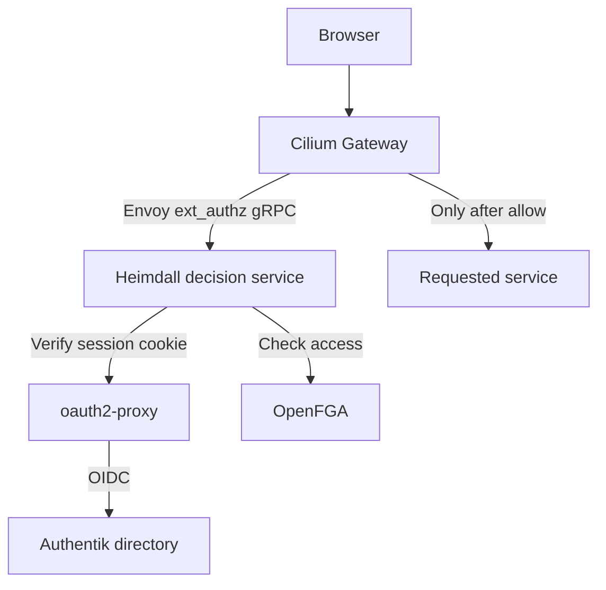

# Elektrokube SSO

Flux-managed identity, authorization, HTTPS and internal DNS for the cluster built by
[elektrokube-scripts](https://github.com/Sebastian-Nowaczyk-Elektrorecykling/elektrokube-scripts).
This repository contains declarative upstream configuration only: no custom application,
image, controller, Python policy, or installation script.



## Routes

| Address | Purpose | Access |
| --- | --- | --- |
| `https://auth.internal/if/user/` | Authentik user portal and account settings | `sso-users` or administrators |
| `https://authentik.admin.internal/if/admin/` | Authentik administration | Administrators only, plus Authentik's native administrator permission |
| `https://openfga.admin.internal/stores` | OpenFGA administration API | Administrators only |

Administrators are members of `cluster-admins` or Authentik's built-in `authentik Admins` group.
The blueprint creates `sso-users` and `cluster-admins`; the latter has native Authentik
superuser privileges. The generated `akadmin` account retains its upstream admin group.
New ordinary accounts must be assigned `sso-users` by an administrator.

Only the three hostnames above have routes and TLS certificates. There are no routes for
Hubble, Longhorn, Garage, or any other pre-existing application. OpenFGA's development
playground is disabled. Heimdall, PostgreSQL, controller endpoints and DNS metrics are
not exposed through HTTP routes.

The identity provider's login flows, OIDC endpoints, required bootstrap APIs and static
assets on `auth.internal` are reachable before SSO. `/oauth2/` on each hostname goes to
oauth2-proxy for login and callback handling. These exceptions terminate at authentication
services, never at a protected application. All application routes use native Gateway API
`ExternalAuth`; ordinary HTTP redirects to HTTPS. Requests for unknown hosts have no route.

Authentik administration keeps its native session check in addition to the external
authorization check. Because it uses a separate origin, its native login may ask you to
authenticate once on that origin as well. `/if/admin/` on the ordinary user hostname
redirects to the administrator hostname. Authentik's own RBAC protects its shared API.

## Install

Prerequisites already provided by the linked repositories:

- Cilium **1.20.2 or newer**, Gateway API **v1.6.1 experimental** CRDs, and a ready `cilium` GatewayClass.
- Existing Flux controllers and ready `cilium`, `gateway-api`, `storage-cnpg` and
  `storage-classes` Kustomizations in `flux-system`.
- CloudNativePG and the `longhorn-cnpg` StorageClass.
- `flux-system/cluster-settings` with the existing IPv4 `API_IP` value. Cilium's host-network
  Gateway listens on this node address. Port 80/443 must be available for this Gateway.
- No independently installed cert-manager or unrelated `sso` namespace. The registration
  script rejects common ownership conflicts rather than adopting them.

On the original first node, update the scripts checkout and run:

```sh
sudo ./gitops-sso.sh
```

The script is in
[elektrokube-scripts/gitops-sso.sh](https://github.com/Sebastian-Nowaczyk-Elektrorecykling/elektrokube-scripts/blob/main/gitops-sso.sh),
based on `gitops-storage.sh` and reusing its existing Flux helpers. It only registers this
repository's `GitRepository` and root `Kustomization`, requests reconciliation and verifies
readiness. It does not install SSO components, create credentials, edit Cilium, or write Git.
Reruns preserve existing registrations and refuse conflicting or suspended resources.

Alternatively, an administrator with the same prerequisites can register the repository directly:

```sh
kubectl apply --server-side --field-manager=kustomize-controller \
  -k https://github.com/Sebastian-Nowaczyk-Elektrorecykling/elektrokube-sso//bootstrap?ref=main
```

Flux installs cert-manager and a namespace-scoped Mittwald secret generator. The latter
generates the Authentik secret key, OIDC client secret, initial administrator password,
OpenFGA API credential and oauth2-proxy cookie key. CloudNativePG generates database
credentials. No passwords or private keys are committed, and the registration script
does not print them.

The graph orders databases before applications, OpenFGA before its policy import,
the identity provider's login routes before OIDC discovery, and authorization services
before protected application routes. A failed dependency blocks its dependent stages.

## DNS and certificate trust

CoreDNS runs on each eligible node and binds only that node's primary IP on **UDP and TCP
port 53**. It uses the same node tolerations as the rest of the stack. Existing node-local
resolvers bound to loopback can remain in place; another resolver bound to the node IP or
all interfaces on port 53 must be moved first.

Configure the LAN resolver to **conditionally forward `internal`** to one or more cluster
node IPs. Alternatively, distribute these DNS servers through DHCP. The repository cannot
change router/DHCP settings or install trust roots on client devices.

Every A query at `internal` or any depth below it returns `cluster-settings.API_IP`:
`auth.internal`, `openfga.admin.internal`, and `a.b.c.d.internal` all resolve. AAAA and
other unsupported record types return NOERROR/NODATA. Other zones are forwarded to the
cluster's existing resolver. DNS answers do not create Gateway routes or certificates.
This is a LAN resolver; restrict node port 53 to your client networks at the network edge.
The Kubernetes cluster DNS configuration is not replaced.

Export the **public** CA certificate and install it into your clients' OS/browser trust store:

```sh
kubectl -n sso get secret sso-root-ca -o jsonpath='{.data.tls\.crt}' \
  | base64 -d > elektrokube-sso-ca.crt
```

Only export `tls.crt`, never `tls.key`. cert-manager issues and renews exact-name server
certificates for the three routes. Public ACME certificates are not used for `.internal`.
oauth2-proxy trusts this CA and uses `API_IP` as a host alias for `auth.internal`, so first
reconciliation does not depend on LAN DNS already being configured. OIDC issuer and TLS
verification remain enabled.

Changing the Gateway node address means updating the existing `cluster-settings.API_IP`.
Flux then updates DNS responses and oauth2-proxy's host alias. The default is a single
Gateway target address; node failover requires a stable address or an explicitly configured
multi-address DNS design.

## First login and session behavior

Retrieve the generated initial password through your existing Kubernetes administrator access:

```sh
kubectl -n sso get secret sso-credentials -o jsonpath='{.data.bootstrap-password}' | base64 -d
```

Open `https://auth.internal/if/user/` and sign in as `akadmin`. Change that initial password,
enroll MFA using Authentik's normal controls, then create ordinary users and assign their
groups. The blueprint does not overwrite passwords or user membership on reconciliation.
It reuses Authentik's upstream flows, signing certificate and standard profile scope;
there are no custom Python expressions.

Each hostname uses its own secure, HTTP-only `__Host-elektrokube_sso` cookie. There is no
cookie for the bare `.internal` suffix. All three exact callback URLs are registered in
Authentik. Moving between services performs an OIDC redirect and reuses the central
Authentik session; it does not require a shared application cookie. PKCE S256 is enabled.

Sessions last **five minutes**, with no refresh token or background refresh. Expiry causes
another OIDC round trip. This bounds stale group membership or disabled-account access to
five minutes. Signing out of Authentik does not instantly revoke an already issued cookie;
use each origin's `/oauth2/sign_out`, or wait for expiry. For emergency revocation, rotate
the cookie key and restart oauth2-proxy. Group names should stay small enough to fit one
cookie; the Heimdall integration deliberately accepts only the single named cookie.

Authorization uses the stable OIDC `sub` UUID, not an email address. oauth2-proxy's email
field is mapped to `sub`; the email scope is not requested. This avoids relying on unverified
directory email addresses. Client-supplied identity/group headers never supply OpenFGA
membership. Only groups returned by oauth2-proxy after cookie verification become
contextual tuples. Missing groups, unknown services, denied checks and dependency errors
deny access. Browser authentication failures redirect to login; API clients receive 401,
and authenticated users without permission receive 403.

## OpenFGA policy lifecycle

`infrastructure/authorization/store.fga.yaml` contains the authorization model, service
grants and executable upstream CLI tests. The retained `openfga-policy-v1` Job runs
`openfga/cli store import` directly, without a shell or custom bootstrap program. User
membership is supplied as contextual tuples on each check; no directory synchronization
job or persisted user-membership copy is needed.

The store is named `elektrokube-sso-v1`. Heimdall discovers it through the authenticated
OpenFGA API and requires exactly one matching store. This avoids hard-coded/generated
store IDs being copied between controllers. The completed Job is retained, has no TTL,
and is not rerun on a normal Flux reconciliation. It has no automatic retry: a partial
import must not silently create multiple stores. The model uses the latest model in this
dedicated, versioned store; only administrators can change it.

To release changed grants or a changed model, increment the version in the store name,
Job name, ConfigMap name/reference and Heimdall discovery/validation configuration in one
commit. Flux imports the new immutable store before reconciling Heimdall. Keep old stores
until rollback is no longer needed. Do not mutate the mounted policy file alone: an
already completed Kubernetes Job does not execute again.

If the import fails, inspect `kubectl -n sso logs job/openfga-policy-v1`. Use a local
administrator port-forward and the upstream `fga` CLI with the generated `openfga-token`
to inspect the store. If a store should be preserved, commit a renamed recovery Job using
the same policy ConfigMap and add `--store-id=<existing-id>` to its `store import` arguments.
The upstream CLI imports into that store and ignores duplicate grants. A new Job name is
necessary because the previous Job has finished and its pod specification is immutable.
The recovery Job must complete before Flux marks the authorization stage ready. If an
incomplete store is disposable, deliberately remove that store with `fga store delete`,
then delete the failed Job and let Flux recreate it. Never delete a healthy store to
address a login issue.
Duplicate stores deliberately deny access until an administrator resolves the ambiguity.
Kubernetes access remains the recovery path even when web SSO is unavailable.

## Operations and validation

```sh
kubectl -n flux-system get kustomizations -l app.kubernetes.io/part-of=elektrokube-sso
kubectl -n sso get pods,jobs,clusters.postgresql.cnpg.io,certificates,httproutes
kubectl -n sso get gateway sso -o yaml
kubectl -n sso get httproutes -o yaml
dig @NODE_IP auth.internal
dig +tcp @NODE_IP a.b.c.d.internal
curl --cacert elektrokube-sso-ca.crt -I https://auth.internal/if/user/
```

After reconciliation, require `Accepted=True` and `ResolvedRefs=True` on every route and
`Programmed=True` on the Gateway. Confirm an ordinary account is denied at both admin
hosts, an administrator is allowed, and an unknown hostname has no application route.
During a controlled maintenance window, make the authorizer unavailable and verify a
protected request fails rather than reaching its backend. These live checks exercise
Cilium routing and policies that offline manifest validation cannot prove.

The shipped policy can be tested without a cluster:

```sh
docker run --rm -v "$PWD/infrastructure/authorization:/policy:ro" \
  openfga/cli:v0.8.1 model test --tests /policy/store.fga.yaml
docker run --rm -v "$PWD/infrastructure/heimdall:/etc/heimdall:ro" \
  -v "$PWD/infrastructure/heimdall:/etc/heimdall-rules:ro" \
  -e OPENFGA_TOKEN=validation-token dadrus/heimdall:0.17.22 \
  validate rules /etc/heimdall/rules.yaml --config /etc/heimdall/config.yaml \
  --insecure-skip-ingress-tls-enforcement --insecure-skip-egress-tls-enforcement
```

Browser traffic uses TLS. Heimdall's internal gRPC and its calls to oauth2-proxy/OpenFGA
use HTTP inside the cluster, with the two corresponding TLS-enforcement exceptions
explicitly configured. Cilium policies restrict these endpoints to their callers and the
Gateway's reserved ingress identity. TLS enforcement for unrelated features and the
deny-by-default rule remain enabled. This does not provide encryption against compromised
nodes; enable cluster transport encryption or add backend TLS when that is required.

Both databases use one CNPG instance and one Longhorn replica, consistent with the base
storage setup. This is not an HA or backup configuration. Before production use, choose
database replication and backups for your failure model. Back up both databases plus
the generated SSO secrets and CA key. Flux orphaning and prune exclusions preserve state
but are not backups. Uninstall deliberately; deleting the root does not delete the stack.

Pinned components: Authentik chart `2026.8.3`, oauth2-proxy `v7.15.4`, Heimdall `0.17.22`,
OpenFGA `v1.21.0`, FGA CLI `v0.8.1`, PostgreSQL `17.11-standard-trixie`, CoreDNS `1.14.7`,
cert-manager chart `v1.21.2`, and Mittwald secret generator chart `3.4.1`.

Upstream references: [Cilium ExternalAuth](https://github.com/cilium/cilium/tree/v1.20.2/examples/kubernetes/gateway/external-authz),
[Heimdall mechanisms](https://dadrus.github.io/heimdall/dev/docs/mechanisms/),
[Authentik blueprints](https://docs.goauthentik.io/customize/blueprints/),
[OpenFGA store files](https://openfga.dev/docs/modeling/store-file-format),
[CoreDNS templates](https://coredns.io/plugins/template/),
[generated secrets](https://github.com/mittwald/kubernetes-secret-generator).
