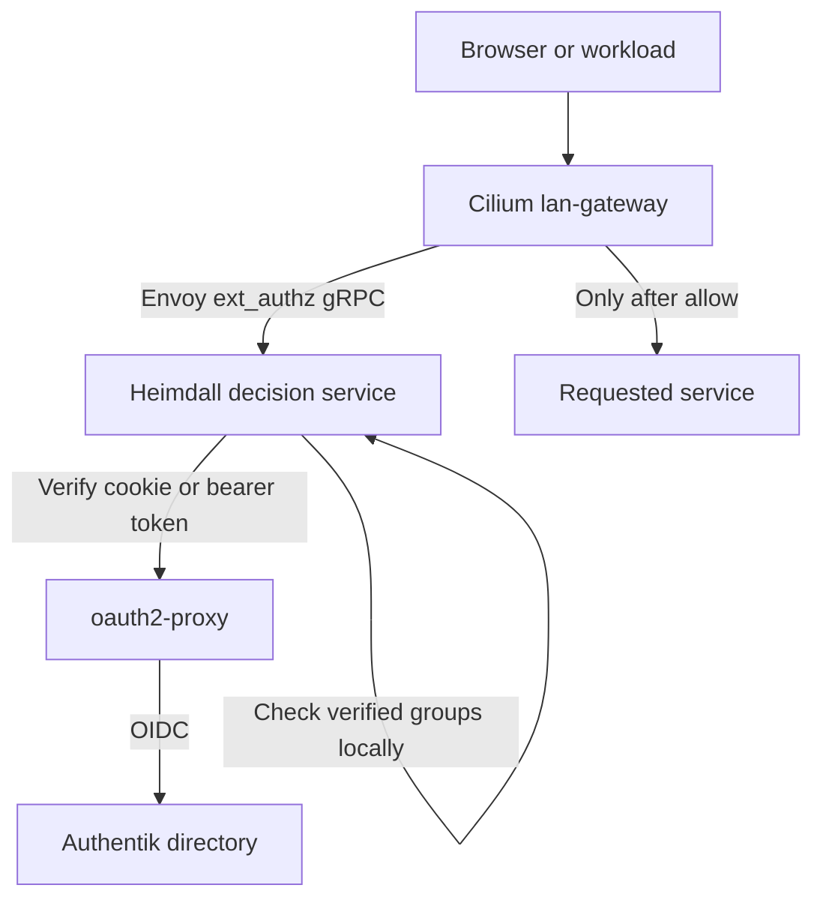

# Elektrokube SSO

Flux-managed identity, authorization, HTTPS and internal DNS for the cluster built by
[elektrokube-scripts](https://github.com/Sebastian-Nowaczyk-Elektrorecykling/elektrokube-scripts).
This repository contains declarative upstream configuration only: no custom application,
image, controller, Python policy, or installation script.



## Routes

| Address | Purpose | Access |
| --- | --- | --- |
| `https://auth.internal/if/user/` | Authentik user portal and account settings | `sso-users` or administrators |
| `https://authentik.admin.internal/if/admin/` | Authentik administration | Administrators only, plus Authentik's native administrator permission |

Administrators are members of `cluster-admins` or Authentik's built-in `authentik Admins` group.
The blueprint creates `sso-users` and `cluster-admins`; the latter has native Authentik
superuser privileges. The generated `akadmin` account retains its upstream admin group.
New ordinary accounts must be assigned `sso-users` by an administrator. See
[permission management](docs/permissions.md) for the UI procedure and per-service groups.

Only the two hostnames above have routes and TLS certificates. There are no routes for
Hubble, Longhorn, Garage, or any other pre-existing application. Heimdall, PostgreSQL,
controller endpoints and DNS metrics are not exposed through HTTP routes.

The Gateway is **`sso/lan-gateway`**, with shared `http` and `https` listeners and no
listener hostname restrictions. Hostnames belong to HTTPRoutes and certificates, not the
Gateway listener. [Register another service](docs/service-onboarding.md) with any depth
of hostname, for example `reports.team.internal`. DNS and the Gateway need no change.
Routes are centrally owned in `sso`; a backend in another namespace uses a narrowly scoped
ReferenceGrant. Namespace-wide permission to publish unprotected routes is not granted.

The identity provider's login flows, OIDC endpoints, required bootstrap APIs and static
assets on `auth.internal` are reachable before SSO. `/oauth2/` on each hostname goes to
oauth2-proxy for login and callback handling. These exceptions terminate at authentication
services, never at a protected application. All application routes use native Gateway API
`ExternalAuth`; ordinary HTTP redirects to HTTPS. Requests for unknown hosts have no route.

Authentik administration keeps its native session check in addition to the external
authorization check. Because it uses a separate origin, its native login may ask you to
authenticate once on that origin as well. `/if/admin/` on the ordinary user hostname
redirects to the administrator hostname. Authentik's own RBAC protects its shared API.

## Fresh installation

Prerequisites already provided by the linked repositories:

- Cilium **1.20.2 or newer**, Gateway API **v1.6.1 experimental** CRDs, and a ready `cilium` GatewayClass.
- Existing Flux controllers and ready `cilium`, `gateway-api`, `storage-cnpg` and
  `storage-classes` Kustomizations in `flux-system`.
- CloudNativePG and the `longhorn-cnpg` StorageClass.
- `flux-system/cluster-settings` with the existing IPv4 `API_IP` value. Cilium's host-network
  Gateway listens on this node address. Port 80/443 must be available for this Gateway.
- No independently installed cert-manager or unrelated `sso` namespace. The registration
  script rejects common ownership conflicts rather than adopting them.

On the original first node, update the scripts checkout and run:

```sh
sudo ./gitops-sso.sh
```

The script is in
[elektrokube-scripts/gitops-sso.sh](https://github.com/Sebastian-Nowaczyk-Elektrorecykling/elektrokube-scripts/blob/main/gitops-sso.sh),
based on `gitops-storage.sh` and reusing its existing Flux helpers. It only registers this
repository's `GitRepository` and root `Kustomization`, requests reconciliation and verifies
readiness. It does not install SSO components, create credentials, edit Cilium, or write Git.
Reruns preserve existing registrations and refuse conflicting or suspended resources.

Alternatively, an administrator with the same prerequisites can register the repository directly:

```sh
kubectl apply --server-side --field-manager=kustomize-controller \
  -k https://github.com/Sebastian-Nowaczyk-Elektrorecykling/elektrokube-sso//bootstrap?ref=main
```

Flux installs cert-manager and a namespace-scoped Mittwald secret generator. The latter
generates the Authentik secret key, OIDC client secret, initial administrator password
and oauth2-proxy cookie key. CloudNativePG generates database
credentials. No passwords or private keys are committed, and the registration script
does not print them.

The cookie key uses 32 random bytes encoded as URL-safe Base64 (`32B`, `base64url`).
Its encoded value is 44 characters, which oauth2-proxy decodes to a 32-byte AES key.
Standard Base64 can contain `+` or `/`, which oauth2-proxy does not accept here.

The checked base repository revisions (`elektrokube-scripts` `c14f849`, Cilium/Flux
`283cec8`, storage `fbc601b`) do not install cert-manager. Cilium 1.20.2 defaults to
Helm-generated Hubble certificates (`hubble.tls.auto.method=helm`); that is separate from
a general-purpose certificate controller. CNPG also manages its own database certificates.
Repository inspection does not prove the live cluster has no separate installation. Check:

```sh
kubectl get deployments -A -l app.kubernetes.io/name=cert-manager
kubectl get crd certificates.cert-manager.io issuers.cert-manager.io clusterissuers.cert-manager.io
kubectl get helmreleases -A
```

The registration script refuses a detected independent cert-manager installation so two
controllers are not installed accidentally. Reusing an independently managed installation
requires adapting the controller stage and its prerequisite checks before registration.

The graph orders Authentik's database before Authentik, the identity provider's login
routes before OIDC discovery, and Heimdall before protected application routes. A failed
dependency blocks its dependent stages.

## DNS and certificate trust

CoreDNS runs on each eligible node and binds only that node's primary IP on **UDP and TCP
port 53**. It uses the same node tolerations as the rest of the stack. Existing node-local
resolvers bound to loopback can remain in place; another resolver bound to the node IP or
all interfaces on port 53 must be moved first.

Configure the LAN resolver to **conditionally forward `internal`** to one or more cluster
node IPs. Alternatively, distribute these DNS servers through DHCP. The repository cannot
change router/DHCP settings or install trust roots on client devices.

Every A query at `internal` or any depth below it returns `cluster-settings.API_IP`:
`auth.internal`, `authentik.admin.internal`, and `a.b.c.d.internal` all resolve. AAAA and
other unsupported record types return NOERROR/NODATA. Other zones are forwarded to the
configured upstreams, currently `8.8.8.8` and `1.1.1.1`. To change the recursive resolvers, edit
[`infrastructure/dns/forwarders.conf`](infrastructure/dns/forwarders.conf), for example:

```text
forward . 192.168.2.1 192.168.2.2
```

Use your own reachable resolver IPs, optionally with `:port`. Flux generates a versioned
ConfigMap and rolls the DNS pods when this setting changes. To use the pod's cluster
resolver instead, set `forward . /etc/resolv.conf`. Do not forward back to these DNS pods or create a cycle
through a router that sends all its queries here. `.internal` answers always stay local,
including NODATA responses; they are never sent upstream.

DNS answers do not create Gateway routes or certificates.
This is a LAN resolver; restrict node port 53 to your client networks at the network edge.
The Kubernetes cluster DNS configuration is not replaced.

Export the **public** CA certificate and install it into your clients' OS/browser trust store:

```sh
kubectl -n sso get secret sso-root-ca -o jsonpath='{.data.tls\.crt}' \
  | base64 -d > elektrokube-sso-ca.crt
```

Only export `tls.crt`, never `tls.key`. cert-manager issues and renews exact-name server
certificates for the two hostnames. Public ACME certificates are not used for `.internal`.
TLS wildcard certificates cover only one label: `*.internal` does not cover
`reports.team.internal`. The onboarding procedure adds an exact SAN for every endpoint,
so deeper names work without weakening certificate verification.
oauth2-proxy trusts this CA and uses `API_IP` as a host alias for `auth.internal`, so first
reconciliation does not depend on LAN DNS already being configured. OIDC issuer and TLS
verification remain enabled.

Changing the Gateway node address means updating the existing `cluster-settings.API_IP`.
Flux then updates DNS responses and oauth2-proxy's host alias. The default is a single
Gateway target address; node failover requires a stable address or an explicitly configured
multi-address DNS design.

## First login and session behavior

Retrieve the generated initial password through your existing Kubernetes administrator access:

```sh
kubectl -n sso get secret sso-credentials -o jsonpath='{.data.bootstrap-password}' | base64 -d
```

Open `https://auth.internal/if/user/` and sign in as `akadmin`. Change that initial password,
enroll MFA using Authentik's normal controls, then create ordinary users and assign their
groups. The blueprint does not overwrite passwords or user membership on reconciliation.
It reuses Authentik's upstream flows, signing certificate and standard profile scope;
there are no custom Python expressions.

Each hostname uses its own secure, HTTP-only `__Host-elektrokube_sso` cookie. There is no
cookie for the bare `.internal` suffix. Both exact callback URLs are registered in
Authentik. Moving between services performs an OIDC redirect and reuses the central
Authentik session; it does not require a shared application cookie. PKCE S256 is enabled.

Sessions last **five minutes**, with no refresh token or background refresh. Expiry causes
another OIDC round trip. This bounds stale group membership or disabled-account access to
five minutes. Signing out of Authentik does not instantly revoke an already issued cookie;
use each origin's `/oauth2/sign_out`, or wait for expiry. For emergency revocation, rotate
the cookie key and restart oauth2-proxy. Group names should stay small enough to fit one
cookie; the Heimdall integration deliberately accepts only the single named cookie.

Identity uses the stable OIDC `sub` UUID, not an email address. oauth2-proxy's email field
is mapped to `sub`; the email scope is not requested. This avoids relying on unverified
directory email addresses. Heimdall checks only groups returned by oauth2-proxy after
cookie or bearer-token verification. Client-supplied identity/group headers grant nothing.
Missing groups, unknown services, denied checks and authentication-service errors deny
access. Browser authentication failures redirect to login; API clients receive 401,
and authenticated users without permission receive 403.

## Non-interactive workloads

Authentik's `client_credentials` grant is enabled. Each workload uses a dedicated
Authentik service account and an expiring **app password**, exchanges it for a five-minute
JWT access token, then sends `Authorization: Bearer <access_token>` to the service's HTTPS
hostname. oauth2-proxy verifies the issuer, audience (`elektrokube`), signature and expiry;
Heimdall checks the verified account's groups against the service rule locally. An invalid bearer token is
rejected rather than falling back to browser login, even when `Accept: text/html` is sent.

See [workload credentials and requests](docs/permissions.md#workload-credentials).
Account creation alone grants no access. Do not distribute oauth2-proxy's shared OAuth
client secret to workloads. Tokens must request `scope=profile` to include group claims.
Existing tokens retain their claims until expiry; revoking the app password prevents new
tokens but does not revoke already issued JWTs immediately.

This protects HTTP requests through `lan-gateway`. It does not turn Kubernetes service
account tokens into SSO tokens, configure SPIFFE/mTLS, change Kubernetes RBAC, or replace
database and application-native authentication. Service-to-service calls must use the
protected hostname if they are to pass through this authorization chain.

## Service permissions

Heimdall's built-in CEL authorizer checks verified Authentik groups on each request.
There is no separate authorization service, policy database or policy-import Job.
The native `service-group` mechanism is defined in `infrastructure/heimdall/config.yaml`;
per-service rules are in `infrastructure/heimdall/rules.yaml`.

- `values.group: sso-users` admits members of `sso-users` to the user portal.
- An empty `values.group` admits administrators only, as on `authentik.admin.internal`.
- Administrators in `cluster-admins` or built-in `authentik Admins` can use every
  registered protected service. An unknown hostname still hits the deny-by-default rule.
- For a new ordinary application, set its rule's `values.group` to an Authentik group
  such as `sso-reports`, then manage membership in Authentik's UI.

Group names are compared exactly. Account creation alone grants no access. Changing a
service's allowed group is a Git edit applied by Flux; adding or removing people from
that group is an Authentik UI operation. The same check applies to browser sessions and
workload tokens. No user-membership synchronization or second permission store is needed.
See [permission management](docs/permissions.md) and [service onboarding](docs/service-onboarding.md).

## Operations and validation

```sh
kubectl -n flux-system get kustomizations -l app.kubernetes.io/part-of=elektrokube-sso
kubectl -n sso get pods,clusters.postgresql.cnpg.io,certificates,httproutes
kubectl -n sso get gateway lan-gateway -o yaml
kubectl -n sso get httproutes -o yaml
dig @NODE_IP auth.internal
dig +tcp @NODE_IP a.b.c.d.internal
curl --cacert elektrokube-sso-ca.crt -I https://auth.internal/if/user/
```

After reconciliation, require `Accepted=True` and `ResolvedRefs=True` on every route and
`Programmed=True` on the Gateway. Confirm an ordinary account is denied at the admin
hostname, an administrator is allowed, and an unknown hostname has no application route.
During a controlled maintenance window, make the authorizer unavailable and verify a
protected request fails rather than reaching its backend. These live checks exercise
Cilium routing and policies that offline manifest validation cannot prove.

Validate the shipped rules with Heimdall's own validator:

```sh
docker run --rm -v "$PWD/infrastructure/heimdall:/etc/heimdall:ro" \
  -v "$PWD/infrastructure/heimdall:/etc/heimdall-rules:ro" \
  dadrus/heimdall:0.17.22 \
  validate rules /etc/heimdall/rules.yaml --config /etc/heimdall/config.yaml \
  --insecure-skip-ingress-tls-enforcement --insecure-skip-egress-tls-enforcement
```

Browser traffic uses TLS. Heimdall's internal gRPC and its calls to oauth2-proxy
use HTTP inside the cluster, with the two corresponding TLS-enforcement exceptions
explicitly configured. Cilium policies restrict these endpoints to their callers and the
Gateway's reserved ingress identity. TLS enforcement for unrelated features and the
deny-by-default rule remain enabled. This does not provide encryption against compromised
nodes; enable cluster transport encryption or add backend TLS when that is required.

Authentik's database uses one CNPG instance and one Longhorn replica, consistent with the base
storage setup. This is not an HA or backup configuration. Before production use, choose
database replication and backups for your failure model. Back up the Authentik database plus
the generated SSO secrets and CA key. Flux orphaning and prune exclusions preserve state
but are not backups. Uninstall deliberately; deleting the root does not delete the stack.

Pinned components: Authentik chart `2026.8.3`, oauth2-proxy `v7.15.4`, Heimdall `0.17.22`,
PostgreSQL `17.11-standard-trixie`, CoreDNS `1.14.7`,
cert-manager chart `v1.21.2`, and Mittwald secret generator chart `3.4.1`.

Upstream references: [Cilium ExternalAuth](https://github.com/cilium/cilium/tree/v1.20.2/examples/kubernetes/gateway/external-authz),
[Heimdall local group authorization](https://dadrus.github.io/heimdall/dev/docs/mechanisms/authorizers/#_local_cel),
[Authentik blueprints](https://docs.goauthentik.io/customize/blueprints/),
[CoreDNS templates](https://coredns.io/plugins/template/),
[generated secrets](https://github.com/mittwald/kubernetes-secret-generator).
See also [Authentik machine-to-machine authentication](https://docs.goauthentik.io/add-secure-apps/providers/oauth2/machine_to_machine/),
[oauth2-proxy bearer-token validation](https://oauth2-proxy.github.io/oauth2-proxy/configuration/overview/),
[Cilium hostname-free HTTPS listeners](https://docs.cilium.io/en/stable/network/servicemesh/gateway-api/default-tls-certificate/),
and [CoreDNS forwarding](https://coredns.io/plugins/forward/).
